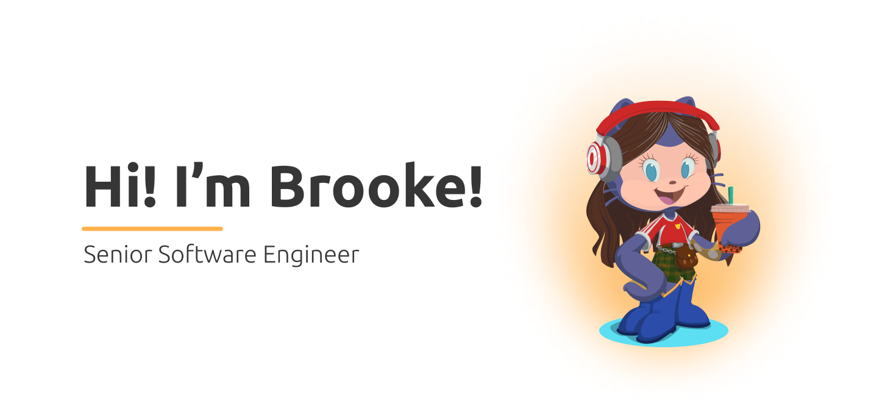

### 🔭 Outside of software development, my interests include: 
- Historical architecture, home design, and home renovation projects
- Learning new skills - currently enrolled in woodworking classes 🪵
- Reading
- Listening to some of my favorite podcasts - Radiolab, Science VS, Milk Street, and Heavyweight

### 🤝 Connect with me:

### 👩🏻‍💻 Technical Skills & Interests

<!--
**Bagorb01/Bagorb01** is a ✨ _special_ ✨ repository because its `README.md` (this file) appears on your GitHub profile.

Here are some ideas to get you started:

- 🔭 I’m currently working on ...
- 🌱 I’m currently learning ...
- 👯 I’m looking to collaborate on ...
- 🤔 I’m looking for help with ...
- 💬 Ask me about ...
- 📫 How to reach me: ...
- 😄 Pronouns: ...
- ⚡ Fun fact: ...
-->
